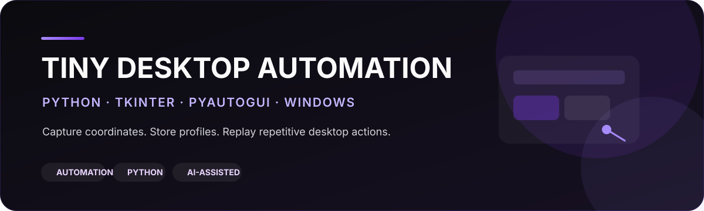

<div align="center">



<br>


**A small Windows automation application that captures screen coordinates, stores local configuration and repeatedly executes configured mouse actions.**

</div>

## Why this project exists

Tiny Desktop Automation was built to reduce repetitive desktop clicking through a simple graphical workflow. The project combines desktop GUI development, input automation, persistent configuration and background execution in a compact Python application.

It is also a practical example of **AI-assisted development**: behavior was defined, implemented, tested on Windows, debugged and iteratively refined with Codex Sol assistance.

## Highlights

- **Tkinter desktop interface** for configuration and control
- **Mouse coordinate capture** after a short countdown
- **Two configurable positions per automation mode**
- **Separate Stationary Troops and Moving Troops profiles**
- **Persistent JSON configuration** stored locally
- **Start / Stop controls** and keyboard hotkeys
- **Background automation loop** using threading
- **Configurable cycle delay** in source code

> This version does **not** record arbitrary mouse movement, full keyboard sequences or free-form macros. It replays the two configured click positions for the selected mode.

## How it works

```text
Choose automation mode
        ↓
Capture Position 1
        ↓
Capture Position 2
        ↓
Coordinates saved locally
        ↓
Start automation
        ↓
Click Position 1 → Position 2 → repeat
```

## Controls

| Control | Action |
|---|---|
| **Start** | Starts the automation |
| **Stop** | Stops the automation |
| **/** | Toggles running / stopped |
| **ESC** | Stops the automation |
| **Capture Position** | Saves the current mouse coordinates after the countdown |

## Run on Windows

### 1. Requirements

- Python 3
- Windows

### 2. Install dependencies

```powershell
py -m pip install -r requirements.txt
```

Or directly:

```powershell
py -m pip install pyautogui keyboard
```

### 3. Run

```powershell
py tiny.py
```

## Local configuration

The application creates a local file named:

```text
tiny_config.json
```

It stores the configured coordinates for each mode. The file is intentionally ignored by Git so machine-specific coordinates are not published.

## Tech stack

| Area | Technology |
|---|---|
| Language | Python |
| GUI | Tkinter |
| Mouse automation | PyAutoGUI |
| Keyboard hotkeys | keyboard |
| Persistence | JSON |
| Background execution | Threading |
| Development assistance | Codex Sol |

## AI-assisted development workflow

Codex Sol was used as a development assistant while the behavior and final validation remained human-directed.

```text
Requirement
   ↓
Prompt-driven implementation
   ↓
Windows testing
   ↓
Behavior / timing issues identified
   ↓
Refinement and debugging
   ↓
Re-test
   ↓
Validated working version
```

This repository documents the project as **AI-Assisted Development**, not autonomous AI generation.

## Repository structure

```text
tiny-desktop-automation/
├── tiny.py
├── requirements.txt
├── README.md
├── .gitignore
├── assets/
│   └── banner.svg
└── docs/
    └── development.md
```

## Screenshots

Real application screenshots are the next visual improvement planned for this repository.

Planned paths:

```text
assets/application.png
assets/capture-position.png
```

## Future ideas

These are **planned ideas**, not current functionality:

- arbitrary action recording
- recorded-sequence replay
- per-action timing
- additional automation profiles
- import / export of profiles

---

<div align="center">

**Built with Python · Tested on Windows · Refined with AI assistance**

</div>
